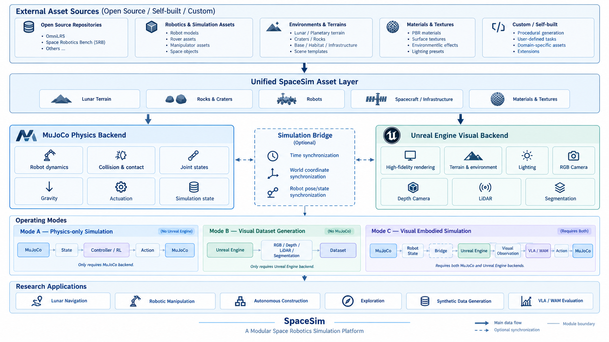
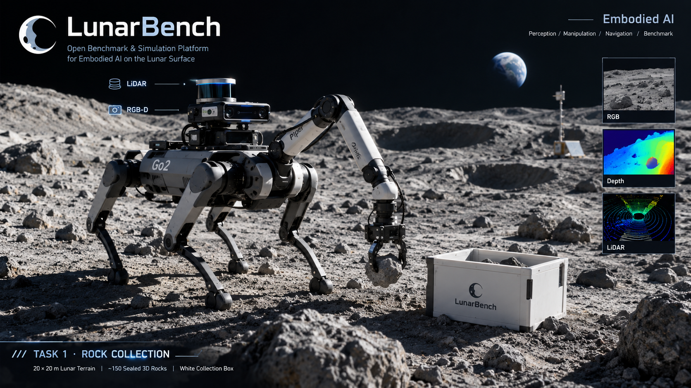

# LunarBench / MoonSim

月面机器人仿真与任务研发。GitHub 仓库名为 **LunarBench**，当前代码目录与实现名为 **MoonSim**。



架构图展示整体设计方向；当前实现状态以各任务文档为准。图中的 RL/VLA/WAM 等模块不代表所有方法都已接入，MJX GPU 物理尚未实现。

## 获取代码

```bash
git clone --recurse-submodules https://github.com/George3215/LunarBench.git
cd LunarBench
```

已有 checkout 执行 `git submodule update --init --recursive`。DrQ-v2 和 GPT-as-Policy 以固定提交的 submodule 引用。地形、机器人网格、模型权重和运行产物不随源码上传，准备方式见 [资源说明](assets/README.md) 和 [源码与依赖范围](docs/REPOSITORY.md)。文档中的 `/home/lry/...` 是本机路径；新机器优先使用下面的仓库相对路径命令。

月面机器人仿真仓库。当前只保留五个核心目录，按实际需要逐步扩展。

```text
MoonSim/
├── assets/       # 统一资源：机器人、地形、物体、障碍物
├── ue/           # UE 场景导入、渲染和已有 demo 的显示逻辑
├── mujoco/       # 机器人动力学、碰撞和控制
├── tasks/        # TASK1 石头收集；TASK2 Qwen 直接控制与强化学习堆叠
├── tools/        # 离线资源转换、启动、部署和验证脚本
└── README.md
```

```text
             assets
            /      \
           UE     MuJoCo
            \      /
              tasks
```

**资源 → UE / MuJoCo → Task。**

## 当前能运行什么

已有月面地形 + Go2 demo。UE 显示完整月面和岩石，MuJoCo 计算机器人与局部地形、岩石的接触。既有 Go2 checkpoint 继续用于 demo 的步态控制，不新增算法接入。

- `assets/environments/`：既有月面等环境资源。
- `assets/robots/go2_demo/`：demo 的 Go2 MJCF、网格、checkpoint、许可与来源资料。
- `ue/import_data/`：已有 R16、岩石实例与材质等离线导入产物。
- `ue/importer/`：原有 UE 资产导入和视口控制源码，属于 UE 实现细节；不建设通用 Plugin 系统。
- `mujoco/generated/`：demo 的固定物理场景、局部高度场与显示数据。
- `mujoco/go2.py`：原有 Go2 仿真；`motion.py` 负责位移目标控制，`streaming.py` 负责局部碰撞窗口。

TASK1 使用 `bridge/` 统一传感器与动作边界，独立 baseline 不读取引擎对象。既有 UE 场景显示 UDP 仍保留在引擎内部。

TASK1 的 UE RGB-D 与 MuJoCo LiDAR 已接入 bridge，默认运行 Z-Mobile-manip 传感器与接近基线。`tasks/` 里目前有 TASK1 与 TASK2（见下两节），不提前创建导航、建造等空任务系统。TASK2 使用独立的 MuJoCo 环境与策略接口，不共用 TASK1 的 bridge。

## TASK1 石头收集



此图用于任务展示，不是自主收集成功的实验记录。

已实现独立的 [TASK1](tasks/task1_collect/README.md)：20×20 m、1 cm 原始地形采样、150 块封闭三维实体石头（最长边 3.9–5.4 cm，逐块在基准体积的 1.5–2 倍之间随机，Piper 夹爪抓得住）、0.3 m 白色实体立方体收集框、默认 Go2-Piper 四足带臂机器人，以及任务内部的 observation/action/state/reward 接口。当前默认关闭得分、持续运行；RGB-D/LiDAR 与独立策略说明见 [baseline 文档](baselines/z_mobile_manip/README.md)。TASK1 使用原始 27.94 m 地形尺度；下文的旧 demo 保留原有场景尺度。两个入口的产物和物理进程分别管理，不同时启动。

```bash
bash /home/lry/MoonUnrealEnv/task1.sh
```

## TASK2 十块石头堆叠

固定 UR5e + Robotiq 2F-140、十块 paper 石头与可达料区，目标为 **4+3+2+1**。
当前两条主线共用场景与接触支撑成功判据：

| 策略 | 观测 | 控制 |
| --- | --- | --- |
| Qwen 直接控制 | `eye_in_hand` / `top` / `front` RGB 与本体状态 | 模型选择 TCP 与夹爪目标，Python 校验和执行 |
| 强化学习 | DrQ-v2 三视角 RGB；SAC 特权状态对照 | 7 维末端增量与夹爪动作，5 cm / 0.35 rad 门限 |

在已有依赖和资产的机器上，从仓库根目录运行：

```bash
# Qwen：需要可用的 VLM 服务，地址配置在 YAML 中
python tasks/task2_stack/run.py --config tasks/task2_stack/configs/upstream_qwen_trials.yaml --view

# RL：8 个 CPU MuJoCo 环境，共享一个 CUDA DrQ-v2 learner，总计 20 万步
WANDB_MODE=online bash tasks/task2_stack/rl.sh --config tasks/task2_stack/configs/rl_stack10_drqv2_200k_parallel.yaml --mode train
```

首次安装与 W&B 登录见 [RL 文档](tasks/task2_stack/docs/RL.md)。每回合上限 1000 步；所有环境合计 200000 个 transition。CPU 物理多进程采样已经接入，**不是 MJX GPU 物理**。训练输出、checkpoint、W&B 本地文件均留在本机。

已完成短训练、网络参数更新、保存/加载与并行运行验证；**尚无十块石头完整堆叠成功的已验证策略**。历史脚本保留作对照，不作为 Qwen 或 RL 的在线抓取兜底。

详细说明：[TASK2](tasks/task2_stack/README.md) · [RL 训练](tasks/task2_stack/docs/RL.md) · [Qwen 提示词与控制](tasks/task2_stack/docs/UPSTREAM_DIRECT.md)。

## 启动已有 demo

以下命令可在本机任意目录执行。切换模式前，先关闭上次启动的窗口。

仅 UE：静态显示月面和 Go2，不启动物理。

```bash
python3 /home/lry/MoonUnrealEnv/MoonSim/tools/run_demo.py --engine ue
```

仅 MuJoCo：显示出生点附近 10×10 米物理区域，运行机器狗。

```bash
python3 /home/lry/MoonUnrealEnv/MoonSim/tools/run_demo.py --engine mujoco
```

保留原有联合 demo：同时打开两个窗口，MuJoCo 计算物理，UE 接收位姿；两个窗口同步相机。

```bash
python3 /home/lry/MoonUnrealEnv/MoonSim/tools/run_demo.py --engine both
```

联合模式使用英文输入法，点击 UE 视口控制，无需点击 Play。单独运行 MuJoCo 时，在 MuJoCo 窗口中控制。

| 按键 | 功能 |
| --- | --- |
| W / S / A / D | 前 / 后 / 左 / 右移动 0.5 米 |
| Q / E | 左 / 右旋转 15° |
| H / L | 降低 / 提高速度档位 |
| 空格 | 停止 |
| R | 重置 |
| P | 暂停 / 继续 |

UE 视口失焦或右键相机操作会停止移动。联合模式的 MuJoCo 窗口用于观察，不接受机器人运动指令。关闭 UE 会停止它创建的物理进程。

## 显示、精度与相机同步

联合模式下，两个窗口共享相机位置、朝向、垂直视场角与宽高比：UE 右键拖动旋转相机；MuJoCo 左键拖动旋转、右键拖动平移、滚轮缩放，Shift 切换水平操作。任一侧操作都会更新另一侧，相机也跟随机器狗平移。UE 用临时相机约束到 MuJoCo 窗口的宽高比，因此可能出现黑边。两者材质、光照及远景覆盖不同，保证的是视角和投影一致，不是 RGB 像素一致。

通信沿用本机 UDP：19400 发送机器人和相机状态，19401 传递既有机器人键盘控制，19402 回传 UE 相机操作。接收端只解码最新状态，不重播积压帧；相机编辑用序号确认，避免旧状态把用户视角拉回。物理固定 500 Hz、状态/显示目标 50 Hz、UE 视口上限 45 FPS，彼此不等待渲染完成确认。操作系统调度和启动加载仍会影响瞬时帧时间；这不是逐帧锁步录制接口。

UE 默认后台节流会在切换到 MuJoCo 窗口后明显降帧。demo 激活期间临时关闭此选项，离开地图或退出时恢复，不保存全局编辑器偏好。MuJoCo 使用原生 GLFW 窗口，动态碰撞区域切换时只重建渲染资源，保留窗口与相机。

精度约束：

- 地形原始网格为 **2795×2795**，原始单位换算后的间距是 1 cm；现有 UE 场景 XY 缩放为 50，所以世界间距是 **0.5 m**。MuJoCo 的 10×10 m 局部窗口为 21×21，逐点截取源数据，没有抽样或插值，也不人为平整地形。
- 岩石传入完整顶点与原始三角面；TASK1 的 **123 块原型**（Apollo 扫描件 + lunar 程序化岩石，5000–6146 顶点、9520–12288 三角面）全部水密，带 UV 与基色贴图。显示不再由顶点凸包替代。
- 机器人使用原始 OBJ；隐藏仅用于碰撞的 group 3 简化形体，不修改碰撞计算。
- 岩石碰撞仍采用 MuJoCo 原生凸网格碰撞。完整显示面保留不代表已经实现凹形三角网格碰撞。MuJoCo 显示局部物理区域，UE 显示完整环境。

`tools/validate_precision.py` 审计原始 USD、R16 和编译后岩石面数（需要 `usd-core`）；`tools/validate_camera_sync.py` 通过真实窗口鼠标操作及 UE 实际投影矩阵验收双向相机同步。相机验收会临时切换窗口焦点及输入法，并关闭它启动的进程。

运行中的诊断在 `mujoco/generated/latency_current.json`、`runtime_metrics.json` 及对应 JSONL：可分别查看 UE 帧间隔、最新状态年龄、回调耗时、相机误差、物理实时率和渲染资源重载耗时。初次加载与正常运行应分开统计。

## 环境与路径

本机环境：UE 5.7.4；外部工程 `/home/lry/文档/Unreal Projects/Moon/Moon.uproject`；Python `/home/lry/miniconda3/envs/moonunreal-mujoco/bin/python`。MuJoCo 依赖固定版本见 `mujoco/requirements.txt`。

换机器可设置 `LUNARBENCH_UE_EDITOR`、`LUNARBENCH_UE_PROJECT`、`LUNARBENCH_PYTHON`。这些环境变量保留旧 demo 命名以兼容部署；启动器自动将 `LUNARBENCH_WORKSPACE` 设置为当前 MoonSim 目录。不需要安装 Python package。

`LUNARBENCH_UE_MAP` 决定 UE 加载哪张地图，默认为原 demo 地图 `/Game/MoonGo2/Maps/MoonTerrain_Go2_FullRender`。它同时会被 C++ 侧读取（`MoonPaths::IsGo2Map`），用来判断当前世界是否该由插件接管。TASK1 也可用 `--ue-map` 传入同一个值。

UE 工程与已导入的地图仍在仓库外。更新 UE C++ 源码后需关闭编辑器并部署构建：

```bash
python3 /home/lry/MoonUnrealEnv/MoonSim/tools/deploy_ue_plugin.py --project '/home/lry/文档/Unreal Projects/Moon/Moon.uproject' --engine /home/lry/UE/UE_5.7.4
```

工具先备份已有插件源码，不重建地图、不覆盖原始地形。

## 地形换皮地图

`/Game/MoonMacro/Maps/MoonTerrain_Macro01_FullRender` 是原 demo 地图的副本，只把地形材质换成了 `moon_macro_01_4k` 贴图集。几何完全一致：高度数据、transform、岩石、Go2 显示部件全部原样带过去，源地图与源材质一律只读。

```bash
python3 /home/lry/MoonUnrealEnv/MoonSim/tools/build_moon_macro_map.py     # 生成
python3 /home/lry/MoonUnrealEnv/MoonSim/tools/validate_moon_macro_map.py  # 验收
LUNARBENCH_UE_MAP=/Game/MoonMacro/Maps/MoonTerrain_Macro01_FullRender \
  bash /home/lry/MoonUnrealEnv/task1.sh
```

材质分两层：母材质 `M_MoonMacro_Landscape` 放 `UV_TileCm` / `NormalScale` / `Specular_Level` 三个参数，每张地图对应一个 MIC 烘自己的值（当前 `MI_MoonMacro01_Landscape`）。以后加地图 = 新 MIC + 新地图资产，母材质不动。

**UV 用世界位置投影，不是 Landscape UV0，这一点有实际后果。** `ALandscape` 的 UV0 是地形空间的 quad 坐标、与 actor scale 无关，而 TASK1 运行时 `task_scene.py` 会把 scale 从地图里烘焙的 `[50,50,25]` 覆盖成 `[1,1,1]`——两种状态下世界尺寸差 50 倍（1397 m vs 27.94 m）。按地形空间平铺的话，demo 态下 4K 贴图会被铺到 1397 m 上变成约 0.1 px/cm，彻底糊掉。世界投影则只是重复次数随尺寸变、永远不会糊。

`UV_TileCm` 默认 1000 cm（4K 贴图约 2.4 mm/像素）：TASK1 态重复约 2.8 次，demo 态重复约 140 次。**这个值是按 TASK1 态标定的**，demo 全景下重复感明显——改 MIC 参数即可调整，不必重建材质。

代价：新 `.umap` 约 185 MB；三张 4K 贴图 `NeverStream=true` 常驻显存约 53 MB。

源贴图里的 `moon_macro_01_disp_4k.png` **未入库也未导入**：本仓库的地形物理是 1 cm 原始高度场、UE 必须渲染同一份几何，位移贴图会破坏这条不变量。也没有生成 `_nor_dx` 派生文件，改用 `UTexture::bFlipGreenChannel` 翻转 OpenGL 约定的绿通道。

## 资源工具与检查

`tools/prepare_unreal_landscape.py`、`prepare_scene_v2.py` 是原有 USD 离线处理工具；`prepare.py`、`export_patch.py`、`export_visual.py` 准备 demo 的物理/显示产物。转换工具按需运行，不在每次启动时重新生成地形。USD 工具额外需要 OpenUSD（`usd-core`）；策略导出工具额外需要 PyTorch，普通 demo 不需要这两项。

`assets/robots/` 下另有五个自包含机械臂目录（`ur10`、`ur10e`、`ur12e`、`so101`、`piper`），每个含 MuJoCo 模型 `arm.xml`、给 UE 的 `.usdz`、上游来源与逐文件校验记录。`tools/prepare_arms.py` 从上游 xacro/URDF/MJCF 生成，`tools/validate_arms.py` 验收 MuJoCo 载入与步进、home 位姿自接触与重力下垂、末端随动，以及 `.usdz` 的连杆坐标系与网格摆位是否逐一对上 MuJoCo 自身运动学。这几套臂目前只是可加载可仿真的资产，没有注册进 TASK1 的机器人 profile，也没有 UE 侧物理或地图改动。

`assets/robots/franka/` 与 `assets/robots/robotiq_2f85/` 不是生成的，是从 MuJoCo Menagerie 原样搬运的 Menagerie 模型（`panda.xml` 与 `2f85.xml`），只有 MuJoCo、没有 `.usdz`。`franka`（Panda）已经作为 TASK2 的可切换机械臂之一接入（见 [TASK2 文档](tasks/task2_stack/README.md)）；`robotiq_2f85` 目前只在 `.local/backups/task2_arm-20260921-183512/` 那一版空白环境里用过。

无界面物理与碰撞检查：

```bash
PYTHONPATH= /home/lry/miniconda3/envs/moonunreal-mujoco/bin/python /home/lry/MoonUnrealEnv/MoonSim/mujoco/run.py --headless --seconds 6 --distance 0.5
PYTHONPATH= /home/lry/miniconda3/envs/moonunreal-mujoco/bin/python /home/lry/MoonUnrealEnv/MoonSim/tools/validate.py
```

`tools/validate_demo_gui.py ue|mujoco|both` 用于本机有界图形验收，会关闭它创建的验证进程。联合验收会短暂操作窗口和输入法并恢复；正常使用请执行 `run_demo.py`。

## 扩展原则与当前边界

新增资源放 `assets/`；引擎相关功能放对应引擎目录；明确的任务逻辑放 `tasks/`；离线工具放 `tools/`。出现实际重复或接入需求时再抽象，不提前建设公共 API。

demo 保持原有地球重力 `-9.81 m/s²`；月球低重力稳定步态未验证。UE 只负责显示，MuJoCo 是唯一物理源。当前是固定资产专用 demo，不承诺任意 USD / 机器人自动可运行。第三方资产公开再分发权尚未确认。

## 本次目录迁移后的实际验证

2026-09-17，本机 UE 5.7.4 / MuJoCo 3.13.0：

- UE 插件重新构建成功；仅 UE 模式加载月面与 Go2，未启动物理子进程。
- 仅 MuJoCo 图形模式运行 6.002 秒，3001 个物理步，正常退出，未跌倒或越界。
- 联合模式收到真实 UE W 按键后，机器人前移 0.48931 米，目标余量 0.00954 米；33 个 UE 显示部件的位姿读回误差为 0 厘米。
- 无界面动态窗口测试运行 12 秒、6000 步，完成一次窗口切换，状态有限且未跌倒。
- 441 个地形高度检查和 7 个岩石接触检查通过。

本机证据保存在外层工作区 `.local/validation/moonsim_*` 日志及 `ue_process.json`、`mujoco_process.json`、`both_process.json`；这些是 demo 工程验收，不是算法或 Benchmark 成绩。

## 通信、精度和相机修复验收（2026-09-17）

本机实际窗口测试：后台节流时典型帧间隔约 334 ms；修复后双向鼠标相机测试的预热后采样中位数为 22.62 ms（约 44 FPS），状态年龄中位数 16.25 ms、UE Python 回调中位数 0.74 ms。相机投影检查通过，三个参考点在 1280×720 归一化画幅上的最大误差小于 0.00004 像素。这里的误差是同一相机状态的投影计算误差，不表示跨进程屏幕刷新零延迟；该短测试按秒采样，也不是完整帧时间分布。

原始 USD 到 R16 的全量高度对比误差为 0，两类岩石编译后面数与原始数据一致。完整 mesh 的 MuJoCo 图形运行完成 12 秒 / 6000 步、一次碰撞区域切换，前进约 1.93 m，未跌倒；切换时渲染资源重载约 31 ms。最终联合模式真实 W 按键回归前移约 0.468 m，剩余目标距离约 0.031 m，未跌倒。

本机详细证据：外层 `.local/validation/performance_camera_precision.json`、`camera_sync_live.json`、`viewer_stream.json` 与 `both_process.json`。修复涉及的源文件和原场景备份位于外层 `.local/backups/performance-camera-20260917-205201/`，UE 部署工具另行保留插件源码备份。
